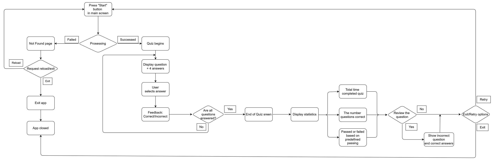
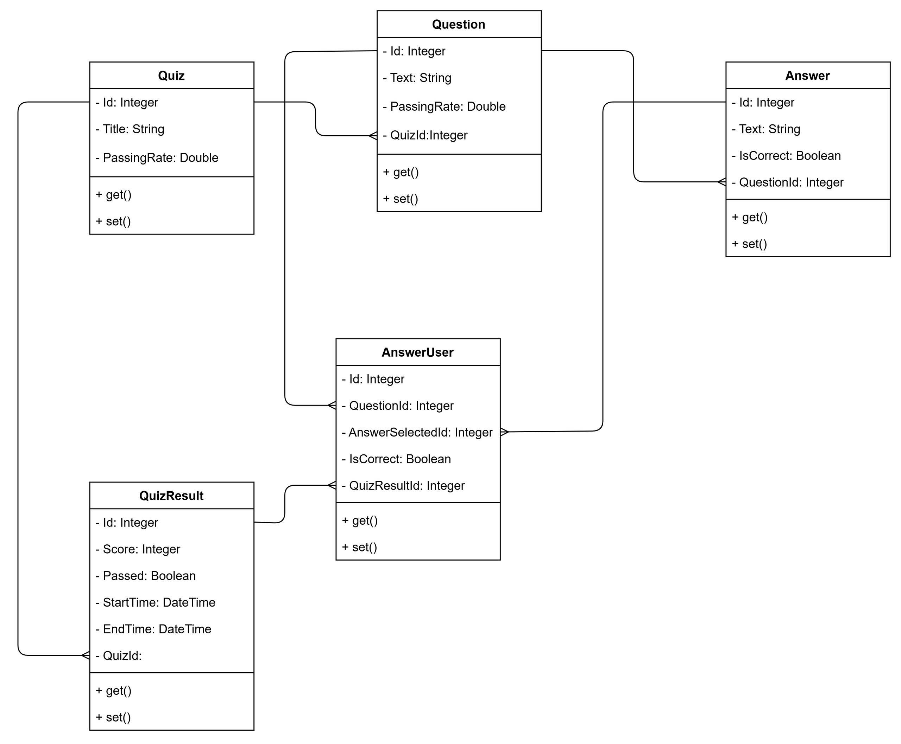

# QuizzApp

## How to Run the Repository, Service, Controller, and Swagger UI

### 1. Repository Layer

The **Repository** layer (files in `Repository/`) handles all data access logic using Entity Framework Core with SQLite.

- `IQuizRepository.cs`: Defines the contract for data operations.
- `QuizRepository.cs`: Implements data access methods (CRUD for quizzes, questions, answers, etc.).

### 2. Service Layer

The **Service** layer (files in `Service/`) holds business logic and acts as a bridge between controllers and repositories.

- `IQuizService.cs`: Defines quiz-related service operations.
- `QuizService.cs`: Implements business logic using the repository.

### 3. Controller Layer

The **Controller** layer (files in `Controllers/`) defines API endpoints for external access (frontend or tools like Postman).

- `QuizController.cs`: Handles HTTP requests, invokes service logic, and returns responses.

### 4. Swagger UI (API Testing Interface)

This project integrates **Swagger UI** using \[Swashbuckle.AspNetCore] to allow easy testing of REST APIs directly from the browser.

- Swagger is automatically enabled in development mode.
- Once the app is running, open your browser and go to:

```
https://localhost:7284/swagger/index.html
```

or (if using HTTP):

```
http://localhost:5003/swagger/index.html
```

You’ll see all available API endpoints (`GET`, `POST`, etc.) with request/response schemas, where you can try them out interactively.

---

## Technologies & Libraries Used

- **.NET 9 / ASP.NET Core** – Web API framework
- **Entity Framework Core** – ORM for database access
- **SQLite** – Lightweight, embedded database
- **Swashbuckle.AspNetCore (Swagger)** – API documentation & UI
- **dotnet CLI** – Build, run, and watch for code changes

---

## Project Structure

```
QuizzApp/
├── Controllers/
│   └── QuizController.cs
├── Data/
│   ├── AppDbContext.cs
│   └── QuizData.cs
├── Models/
│   ├── Answer.cs
│   ├── AnswerUser.cs
│   ├── Question.cs
│   ├── Quiz.cs
│   ├── QuizResult.cs
│   └── DTOs/
│       └── SubmitAnswerDto.cs
├── Repository/
│   ├── IQuizRepository.cs
│   └── QuizRepository.cs
├── Service/
│   ├── IQuizService.cs
│   └── QuizService.cs
├── Migrations/
├── sql
    └── quizz_data.sql
├── Program.cs
├── appsettings.json
├── appsettings.Development.json
├── quizz.db
├── QuizzApp.csproj
├── QuizzApp.sln
└── README.md
```

---

## Main API Endpoints in `QuizController`

- **\[GET] /api/quiz/{quizId}/questions** – Returns all quiz questions with answers for a specific quiz.
- **\[POST] /api/quiz/submit-answer** – Submits a selected answer (`QuizResultId`, `QuestionId`, `AnswerSelectedId`).
- **\[GET] /api/quiz/result/{quizResultId}** – Returns the quiz result of a specific attempt.
- **\[POST] /api/quiz/{quizId}/start** – Starts a new quiz session and returns `QuizResultId`.
- **\[POST] /api/quiz/result/{quizResultId}/end** – Marks the quiz as finished and stores the end time.

All endpoints are documented in Swagger for testing.

---

## How to Run the Project (with Hot Reload + Swagger)

```sh
dotnet build         # Build the project
dotnet watch run     # Run with hot reload
```

## User flow diagram



## Entity relationship diagram


